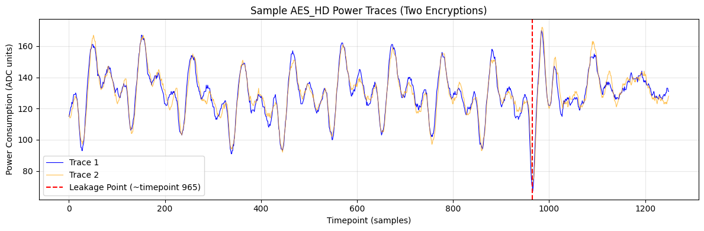
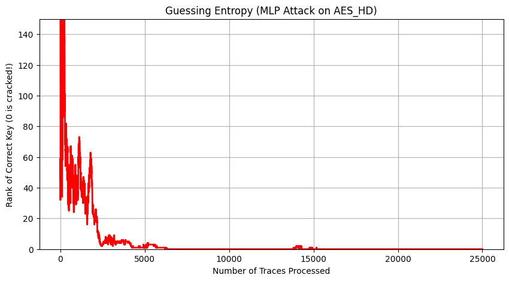
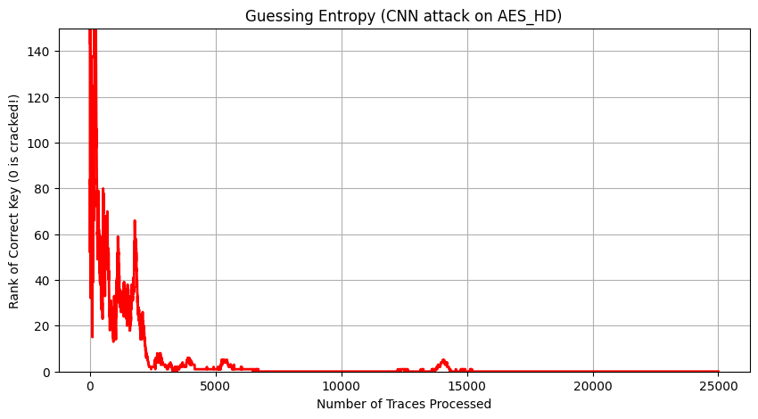
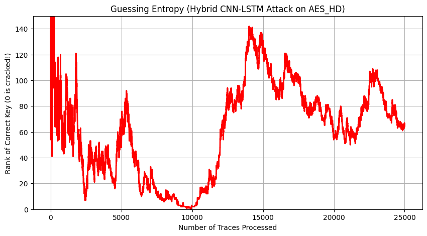

# Deep Learning-Based Power Side-Channel Analysis on AES-128

## Overview

This project investigates the effectiveness of deep learning architectures for power side-channel attacks (SCA) against AES-128 cryptographic implementations.

Three neural network models were evaluated:

* Multi-Layer Perceptron (MLP)
* 1D Convolutional Neural Network (CNN)
* Hybrid CNN-LSTM

The models were trained on power traces to classify the Hamming Weight of AES S-Box outputs and evaluated using Guessing Entropy (GE), the standard metric for key recovery success in side-channel analysis.

---

## Datasets

* **AES_HD** – Unmasked FPGA implementation of AES-128
* **ASCAD** – First-order Boolean masked AES implementation on ATMega8515

---

## Results

| Model    | Accuracy | Final Key Rank | Status  |
| -------- | -------- | -------------- | ------- |
| MLP      | 26.04%   | Rank 0         | Success |
| CNN      | 26.70%   | Rank 0         | Success |
| CNN-LSTM | 26.65%   | Rank 68        | Failed  |

---

## Key Findings

* Guessing Entropy is a more reliable metric than classification accuracy for evaluating side-channel attacks.
* CNN successfully handled clock jitter and noise present in FPGA traces.
* CNN-LSTM achieved similar classification accuracy to CNN but failed in key recovery.
* MLP failed on the masked ASCAD dataset but successfully recovered the AES key on AES_HD.

---

## Sample Power Trace

---

## Guessing Entropy Results

### MLP

### CNN

### CNN-LSTM

---

## Project Report

📄 [Project Report (PDF)](report.pdf)

---

## Author

**Aswanth Gopal**

B.Tech Electronics and Communication Engineering

National Institute of Technology Calicut
